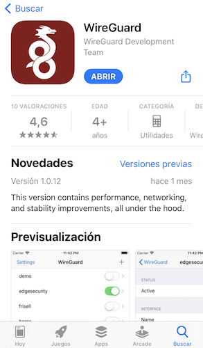
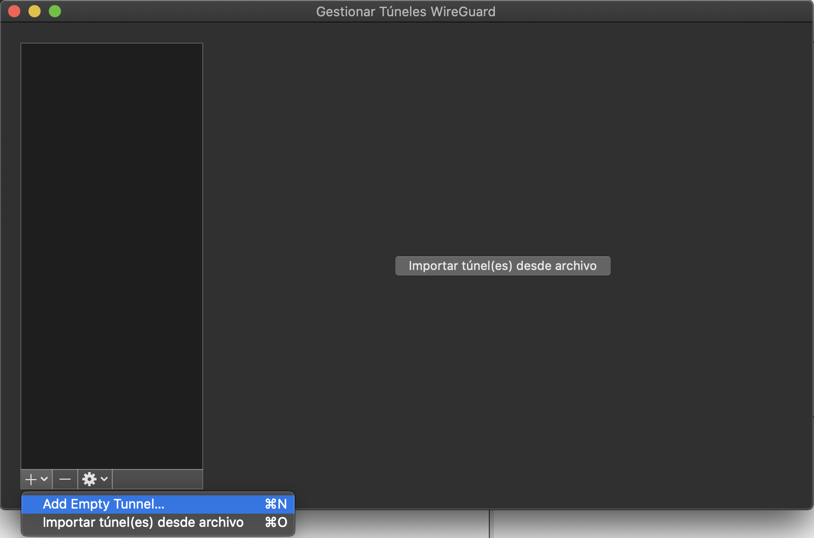
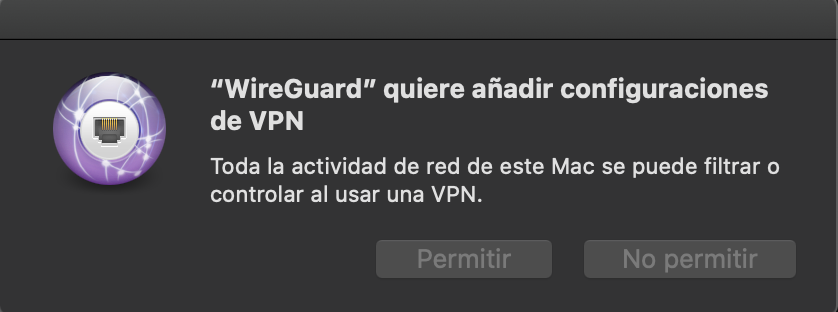
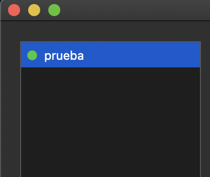
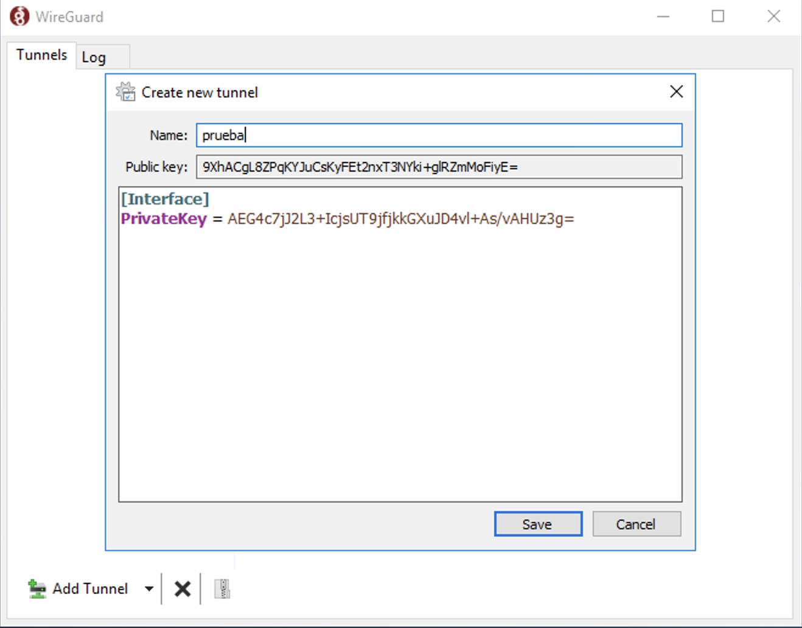
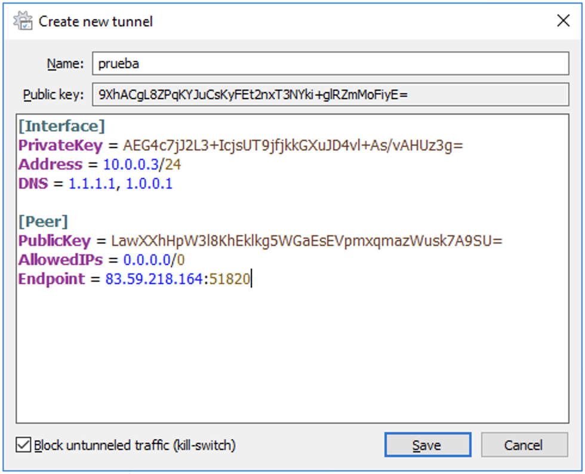
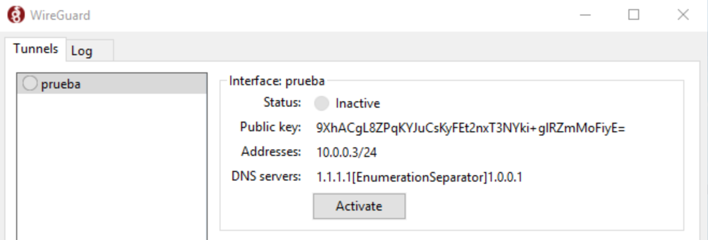

summary: Cómo instalar y configurar WireGuard en Ubuntu Server 20.04
id: wireguard-ubuntu-server-20
categories: Ubuntu Server
tags: ubuntu
status: Published
authors: [Jay Rogers](https://serversideup.net/courses/gain-flexibility-and-increase-privacy-with-wireguard-vpn/). Adaptación al castellano por [David Romero](https://davidlms.com)
feedback link: https://github.com/DavidLMS/davidlms.github.io/issues/new?title=Error+en+gu%C3%ADa+Wireguard+en+Ubuntu+Server

# WireGuard en Ubuntu Server 20.04
## Introducción
Duration: 2

En esta guía práctica vamos a ver paso a paso cómo podemos configurar una red VPN con WireGuard en un servidor con Ubuntu Server 20.04. También veremos cómo podemos conectar a ese servidor VPN un cliente móvil y otro cliente de escritorio a través de la red pública, de forma que simulen ser teletrabajadores haciendo uso de los recursos de la red privada de la empresa en la que se encuentra el servidor VPN. Concretamente, el esquema propuesto durante esta guía es el siguiente:


Crearemos un túnel VPN de comunicación segura entre cada uno de los clientes y el servidor.

**Nota importante 1**: Para seguir esta guía necesitas que el servidor que vayas a utilizar tenga una IP pública. Como es poco habitual que esto ocurra en un entorno de prácticas, tienes la opción de configurar un reenvío de puerto.
Si lo haces en tu casa, configura en tu router que el puerto 51820 sea redirigido al puerto 51820 de la IP local de tu servidor.
Si lo haces en un aula, pide a tu instructor que lo haga cuando quieras hacer la prueba de conexión.
Si no fuera posible ninguna de las opciones anteriores, quizás puedas alquilar un servidor público para hacer la prueba. Por ejemplo, servicios en la nube como AWS y Azure ofrecen cuentas con créditos gratuitos para estudiantes.

**Nota importante 2**: Durante la guía, todos los parámetros que haya que sustituir se mostrarán entre corchetes. Por ejemplo, si la IP de tu servidor es 192.168.1.100 y en el comando aparece [IP_SERVIDOR]:
```
ping [IP_SERVIDOR]
```
Tendrás que sustituirlo por tu parámetro sin incluir los corchetes. Por ejemplo:
```
ping 192.168.1.100
```
<!-- ------------------------ -->
## Configurar el servidor VPN
Duration: 25

### Actualización del servidor

Es importante, antes de instalar cualquier paquete en un servidor, actualizar el sistema y los repositorios:

```
sudo apt update && sudo apt upgrade
```

Es posible que la actualización requiera un reinicio del sistema, para comprobarlo, mostramos el contenido del archivo reboot-required:

```
cat /var/run/reboot-required
```

Si aparece `*** System restart required ***`, es necesario reiniciar. Puedes hacerlo con el comando:

```
sudo reboot
```

### Instalar SSH para acceder remotamente al servidor (opcional)

Es buena idea instalar el servicio SSH, para poder acceder al servidor desde un cliente y configurarlo más cómodamente. Para ello, ejecutamos el comando:

```
sudo apt install ssh
```

Ahora ya podremos conectarnos al servidor desde una terminal de un cliente en la misma red, poniendo el siguiente comando:

```
ssh [USUARIO]@[IP_SERVIDOR]
```

Sustituyendo [USUARIO] por el nombre de usuario del servidor e [IP_SERVIDOR] por la IP del servidor. También puedes utilizar un software como [Putty](https://www.putty.org/) para la conexión.

Si es la primera vez que te conectas, te preguntará si estás seguro de querer continuar, ya que la clave del servidor no se ha establecido como auténtica previamente:

```
The authenticity of host '[IP__SERVIDOR] ([IP_SERVIDOR])' can't be established.
ECDSA key fingerprint is SHA256:[FINGERPRINT_SERVIDOR].
Are you sure you want to continue connecting (yes/no/[fingerprint])?
```

Escribimos `yes` y nos pedirá la contraseña del usuario del servidor.

Ya podremos conectarnos cada vez que lo necesitemos.

###Instalar el servidor VPN WireGuard

La instalación en esta versión es tan sencilla como ejecutar:

```
sudo apt install wireguard
```

###Generar las claves del servidor

El servidor necesita una clave privada y otra pública para funcionar, así que vamos a generarlas.

Con el siguiente comando, creamos una carpeta en la que guardar las claves (la opción `-p` indica a `mkdir` que, si es necesario, cree todas las carpetas de la ruta que no existan):

```
sudo mkdir -p /etc/wireguard/keys
```

Para generar una clave privada para WireGuard, se utiliza el comando:

```
wg genkey
```

Cada vez que lo ejecutes, se generará una diferente. Puedes copiar esa clave o directamente almacenarla en un archivo.

Necesitamos acceder al usuario root para almacenar la clave en la carpeta que hemos creado, para eso ejecutamos:

```
sudo su
```

Almacenamos la clave en el archivo server.key con el comando:

```
wg genkey > /etc/wireguard/keys/server.key
```

El comando `wg pubkey` recibe una clave privada por la entrada estándar y genera su clave pública asociada. Si queremos que genere una clave pública de la clave privada server.key que generamos previamente, podemos hacerlo con el comando:

```
cat /etc/wireguard/keys/server.key | wg pubkey
```

Nos mostrará la clave pública por pantalla. En lugar de copiarla manualmente, podemos escribirla directamente en el archivo server.key.pub como hicimos previamente con la clave privada:

```
cat /etc/wireguard/keys/server.key | wg pubkey > /etc/wireguard/keys/server.key.pub
```

Ya no es necesario seguir usando el usuario root, por lo que volvemos al nuestro ejecutando:

```
exit
```

Ya están las claves necesarias generadas. Podemos ver nuestra clave privada ejecutando el comando:

```
sudo cat /etc/wireguard/keys/server.key
```

¡Recuerda no compartir nunca tu clave privada!

También podemos acceder a ver nuestra clave pública ejecutando:

```
sudo cat /etc/wireguard/keys/server.key.pub
```

###Determinar la interfaz que vamos a enrutar

Es necesario conocer el nombre de la interfaz que queremos enrutar a través del túnel, ya que tendremos que escribirlo en la configuración. Si el servidor se conecta a Internet a través de la misma interfaz que a su red local, el siguiente comando te lo revelará:

```
ip -o -4 route show to default | awk '{print $5}'
```

El nombre que a mí me muestra es `ens3`. Anota el tuyo.

Si el servidor se conecta a Internet usando una interfaz distinta a la interfaz a través de la cual se conecta a la red privada a la que queremos que acceda el cliente VPN, tendremos que obtener el nombre analizando todas las interfaces que aparecen ejecutando el comando:

```
ip add
```

La interfaz de la red local será aquella que tenga configurada una IP del rango de la red privada.

###Configurar la interfaz para WireGuard
WireGuard funciona añadiendo una interfaz de red a nuestro servidor, que es la que utilizará el túnel VPN. La llamaremos `wg0`.

Creamos el archivo de configuración de la interfaz:

```
sudo nano /etc/wireguard/wg0.conf
```

Con el siguiente contenido:

```
[Interface]
Address = 10.0.0.1/24
ListenPort = 51820
PrivateKey = [CLAVE_PRIVADA_SERVIDOR]
PostUp = iptables -A FORWARD -i %i -j ACCEPT; iptables -t nat -A POSTROUTING -o [NOMBRE_INTERFAZ_INTERNET] -j MASQUERADE
PostDown = iptables -D FORWARD -i %i -j ACCEPT; iptables -t nat -D POSTROUTING -o [NOMBRE_INTERFAZ_INTERNET] -j MASQUERADE
SaveConfig = true
```

Sustituyendo [CLAVE_PRIVADA_SERVIDOR] por la clave privada que generamos anteriormente, guardada en el archivo server.key y [NOMBRE_INTERFAZ_INTERNET] por el nombre de la interfaz anotado en el paso anterior.

La IP que está escrita en la directiva `Address` puede ser cualquiera. Será la IP (y máscara de red) que tendrá configurada la interfaz wg0 para la conexión VPN. Los clientes VPN que conectemos posteriormente, deberán tener en la interfaz de túnel VPN que configuremos una IP de la misma red.

El puerto escrito en la directiva `ListenPort` será el puerto a través del cual escuchará el servicio de WireGuard en el servidor.

Por ejemplo, el contenido de mi archivo queda así:

```
[Interface]
Address = 10.0.0.1/24
ListenPort = 51820
PrivateKey = SF5GNe5Afq2xHkb/Trq3/tdgfZIrHcDLCk6yojkCi2B=
PostUp = iptables -A FORWARD -i %i -j ACCEPT; iptables -t nat -A POSTROUTING -o ens3 -j MASQUERADE
PostDown = iptables -D FORWARD -i %i -j ACCEPT; iptables -t nat -D POSTROUTING -o ens3 -j MASQUERADE
SaveConfig = true
```

Pulsamos `CTRL+X` para salir, escribiendo `Y` y pulsando la tecla `ENTER` para guardar los cambios.

###Establecer los permisos de acceso a la clave privada y a la configuración

Debemos asegurarnos que solamente el usuario administrador pueda acceder a la clave privada. Como está escrita en el archivo server.key y en el archivo wg0.conf, les daremos los permisos necesarios para que solo sean accesibles por ese usuario:

```
sudo chmod 600 /etc/wireguard/wg0.conf /etc/wireguard/keys/server.key
```

###Encender la interfaz de WireGuard
Con el siguiente comando levantamos la interfaz `wg0` recién creada:

```
sudo wg-quick up wg0
```

Tendrás una salida similar a la siguiente:

```
[#] ip link add wg0 type wireguard
[#] wg setconf wg0 /dev/fd/63
[#] ip -4 address add 10.0.0.1/24 dev wg0
[#] ip link set mtu 1420 up dev wg0
[#] iptables -A FORWARD -i wg0 -j ACCEPT; iptables -t nat -A POSTROUTING -o ens3 -j MASQUERADE
```

Podemos comprobar el estado de la interfaz con el siguiente comando:

```
sudo wg show wg0
```

Aparecerá algo similar a lo siguiente:

```
interface: wg0
  public key: LawXXhHpW3l8KhEklkg5WGaEsEVpmxqmazWusk7A9SU=
  private key: (hidden)
  listening port: 51820
```

###Iniciar la interfaz de WireGuard automáticamente al arrancar

Con el siguiente comando configuramos que se inicie la interfaz de WireGuard cada vez que se encienda el servidor:

```
sudo systemctl enable wg-quick@wg0
```

###Configurando el tráfico de red y el cortafuegos

####Permitir el reenvío de tráfico

Para que WireGuard pueda reenviar los paquetes entre interfaces, es necesario activar la opción. Para ello, abrimos el archivo sysctl.conf:

```
sudo nano /etc/sysctl.conf
```

Tenemos que buscar la línea `net.ipv4.ip_forward=1` y descomentarla, es decir, borrar la almohadilla (#) que tiene delante. Guardamos el archivo y aplicamos los cambios ejecutando:

```
sudo sysctl -p
```

####Abrir el puerto de WireGuard y activar el cortafuegos (opcional)

Si no tienes el cortafuegos por defecto activado en el servidor, no es necesario que realices estos pasos. Sin embargo, es recomendable abrir solamente los puertos que vayan a utilizarse por seguridad.

Para abrir el puerto de escucha para WireGuard que configuramos, ejecutamos:

```
sudo ufw allow 51820/udp
```

Si estamos accediendo por SSH, que no se nos olvide abrir también el puerto que estemos utilizando, o perderemos la conexión. Por defecto es el puerto 22:

```
sudo ufw allow 22/tcp
```

Una vez aplicadas las reglas, ya podemos activar el cortafuegos:

```
sudo ufw enable
```

Podemos comprobar que está funcionando con las reglas correctas ejecutando el comando:

```
sudo ufw status verbose
```

Recuerda que si en la red local del servidor hay otros cortafuegos en la ruta de acceso a Internet, también tendrás que abrir el puerto de escucha de WireGuard en ellos. De la misma forma, recuerda que en el caso de que el servidor no tenga una IP pública, configurar el reenvío de puerto necesario.

###Añadiendo clientes

Ya tenemos el servidor preparado para funcionar. Solamente falta añadir los clientes que queramos conectar. Si ya sabes la clave pública de un cliente al que quieres permitir la conexión y la IP que deseas proporcionarle, en el servidor solamente tendrías que ejecutar el siguiente comando:

```
sudo wg set wg0 peer [CLAVE_PUBLICA_CLIENTE] allowed-ips [IP_CLIENTE_VPN]
```

Sustituyendo [CLAVE_PUBLICA_CLIENTE] por la clave pública del cliente y [IP_CLIENTE_VPN] por la IP que deseas proporcionarle en la conexión VPN. Recuerda que debe pertenecer a la misma red que la IP que le pusiste al servidor en la directiva `Address` de la configuración.

¿No sabes cuál es la clave pública de tu cliente? No te preocupes, en los siguientes apartados veremos cómo hacer la conexión paso a paso en un cliente móvil (iOS/Android) o en un cliente de escritorio (macOS/Windows/Ubuntu Desktop).


<!-- ------------------------ -->
## Configurar un cliente móvil
Duration: 20

###Crear las claves del cliente

Al contrario de lo que sucede en un sistema de escritorio como macOS o Windows, en el caso de iOS y Android no se nos suministran las claves del cliente, por lo que tendremos que generarla nosotros mismos en el servidor.

Las claves de los clientes puedes almacenarlas en cualquier directorio. En nuestro caso, lo haremos en /etc/wireguard/clients. Si no existe previamente, tendremos que crearlo:

```
sudo mkdir -p /etc/wireguard/clients
```

A continuación, generaremos las claves exactamente de la misma forma que hicimos para generar las del servidor. Les pondremos el nombre que queramos (lo ideal es que te sirva para identificar al cliente). En este caso pondremos de nombre mobile.

Necesitamos acceder al usuario root para realizar cambios en esa carpeta, para eso ejecutamos:

```
sudo su
```

Generamos la clave privada:

```
wg genkey > /etc/wireguard/clients/mobile.key
```

Y la pública:

```
cat /etc/wireguard/clients/mobile.key | wg pubkey > /etc/wireguard/clients/mobile.key.pub
```

Podemos salir del usuario root ejecutando:

```
exit
```

Ya están las claves del cliente generadas. Podemos ver la clave privada del cliente ejecutando el comando:

```
sudo cat /etc/wireguard/clients/mobile.key
```

¡Recuerda no compartir nunca tu clave privada!

También podemos ver la clave pública del cliente ejecutando:

```
sudo cat /etc/wireguard/clients/mobile.key.pub
```

Anota la clave privada porque será necesaria para el archivo de configuración del cliente.

###Crear un archivo de configuración para el cliente

Crearemos el archivo mobile.conf:

```
sudo nano /etc/wireguard/clients/mobile.conf
```

Y le ponemos el siguiente contenido:

```
[Interface]
PrivateKey = [CLAVE_PRIVADA_CLIENTE]
Address = [IP_VPN_CLIENTE]/24
DNS = 1.1.1.1, 1.0.0.1

[Peer]
PublicKey = [CLAVE_PÚBLICA_SERVIDOR]
AllowedIPs = 0.0.0.0/0
Endpoint = [IP_PÚBLICA_SERVIDOR]:51820
```

Sustituyendo [CLAVE_PRIVADA_CLIENTE] por la clave privada del cliente que hemos generado en el paso anterior y almacenado en mobile.key, [IP_VPN_CLIENTE] por la IP que le queramos poner al cliente en la red VPN, [CLAVE_PÚBLICA_SERVIDOR] por la clave pública del servidor que guardamos en server.key.pub y [IP_PÚBLICA_SERVIDOR] por la IP pública del servidor en la WAN.

Por ejemplo, mi archivo queda así:

```
[Interface]
PrivateKey = qNHXjj5J8t4mVzi0GLsTosAGA8j4wjAIdQQ1W/Zna2a=
Address = 10.0.0.2/24
DNS = 1.1.1.1, 1.0.0.1

[Peer]
PublicKey = LawXXhHpW3l8KhEklkg5WGaEsEVpmxqmazWusk7A9SU=
AllowedIPs = 0.0.0.0/0
Endpoint = 83.59.218.164:51820
```

Ten en cuenta que puedes cambiar los servidores DNS por los que quieras que use el cliente. También puedes añadir más seguridad permitiendo solamente a determinadas IPs que puedan conectarse al servidor con esta configuración en la directiva `AllowedIPs`. En este caso he dejado que cualquier IP pueda hacerlo.

###Permitir el acceso al cliente en el servidor

Ahora que ya tienes clara la clave pública y la IP que se le va a asignar al cliente, puedes ejecutar el comando que vimos en el apartado [Añadiendo clientes](#añadiendo-clientes) para permitir la conexión al servidor:

```
sudo wg set wg0 peer [CLAVE_PUBLICA_CLIENTE] allowed-ips [IP_CLIENTE_VPN]
```

Sustituyendo [CLAVE_PUBLICA_CLIENTE] por la clave pública del cliente (archivo mobile.key.pub) y [IP_CLIENTE_VPN] por la IP que deseas proporcionarle en la conexión VPN. 

En mi caso quedaría así:

```
sudo wg set wg0 peer qtAufkgUm3kmISt3ZpV4kg7Jie9PGRlug/WoBl/TsG7= allowed-ips 10.0.0.2
```

###Generar un código QR con la configuración

Sería suficiente con pasar el archivo mobile.conf a la app WireGuard del cliente, pero es más sencillo generar un QR con el contenido del archivo para no tener que pasarlo manualmente al móvil.

Para ello necesitaremos instalar el siguiente paquete:

```
sudo apt install qrencode
```

Tenemos que acceder al usuario root de nuevo para realizar el QR del archivo, para eso ejecutamos:

```
sudo su
```

Y con el siguiente comando generamos el código QR del archivo mobile.conf:

```
qrencode -t ansiutf8 < /etc/wireguard/clients/mobile.conf
```


Ahora ya podremos coger el móvil con el que queramos conectarnos al servidor.

###Instalar la app cliente de WireGuard

La app de WireGuard está disponible tanto en la [Play Store](https://play.google.com/store/apps/details?id=com.wireguard.android&hl=es&gl=US) para Android, como en la [App Store](https://apps.apple.com/es/app/wireguard/id1441195209) para iOS (y iPadOS). Así que solamente tienes que buscarla o pulsar en los enlaces y descargarla.

###Configurar el cliente VPN en iOS

Primero abrimos la app **WireGuard**.



Pulsamos en **Agregar un túnel**.


A continuación elegimos **Crear desde código QR**.


**Escaneamos el código QR** con la cámara y le ponemos **un nombre cualquiera** al túnel.


El sistema nos pedirá **permiso** para añadir y activar la configuración VPN.


Por último, **activamos la configuración añadida** y veremos como aparece la palabra VPN en la información susperior del sistema, indicando que estamos conectados a Internet a través del servidor configurado.


Puedes ver cómo comprobar que estamos conectados correctamente a la red local del servidor en el apartado [Probando la conexión del cliente](#4).

###Configurar el cliente VPN en Android

Primero abrimos la app **WireGuard**.


Pulsamos en el **icono +** en azul para añadir una nueva configuración de túnel.


Elegimos la opción **Escanear desde código QR**.


Damos los **permisos necesarios** a la app para acceder a la cámara.


**Escaneamos el código QR** y le ponemos **un nombre cualquiera** a la configuración del túnel.


**Pulsamos en el slider** para activar la configuración VPN que acabamos de añadir y **aceptamos la solicitud de conexión** del sistema Android.


**El túnel estará activado** y en la parte superior aparecerá el icono de una llave para indicarlo.


Puedes ver cómo comprobar que estamos conectados correctamente a la red local del servidor en el apartado [Probando la conexión del cliente](#4).

<!-- ------------------------ -->
## Configurar un cliente de escritorio
Duration: 10

###macOS Catalina

Primero accedemos a la **App Store** y descargamos la aplicación **Wireguard**.


Una vez instalada, la abrimos y pulsamos en el **icono +** para elegir **Add Empty Tunnel...** Nos permitirá configurar un nuevo túnel VPN.



Nos generará automáticamente **la clave pública y la clave privada del cliente**. Apunta la clave pública porque te hará falta en el último paso para permitir el acceso de este cliente en el servidor. Le ponemos **el nombre que queramos**. También podemos marcar que la VPN se active automáticamente cuando estemos conectados mediante Ethernet, Wi-Fi o ambos.


Dentro del apartado `Interface` añadimos la directiva `Address` con la IP que queremos asignar al cliente (10.0.0.3/24 en nuestro esquema) y la directiva DNS, en la que indicaremos los servidores DNS que queremos utilizar cuando tengamos el túnel activado.

Escribimos un nuevo apartado `Peer` en el que indicaremos tres directivas:
- `PublicKey`, la clave pública del servidor.
- `AllowedIPs`, IPs permitidas para el servidor, podemos dejar 0.0.0.0/0 para indicar que cualquiera tendrá acceso.
- `Endpoint`, donde indicamos la IP pública del servidor y el puerto.

En mi caso, el texto queda así:

```
[Interface]
PrivateKey = wEyjkOyB0LsPLYdoOL6u7X8OXxXsK1Om0FKwt5d3Clk=
Address = 10.0.0.3/24
DNS = 1.1.1.1, 1.0.0.1

[Peer]
PublicKey = LawXXhHpW3l8KhEklkg5WGaEsEVpmxqmazWusk7A9SU=
AllowedIPs = 0.0.0.0/0
Endpoint = 83.59.218.164:51820
```


Pulsamos en  **Guardar** y el sistema nos pedirá permiso para añadir la configuración VPN. Le damos a **Permitir**.



Ya podremos **activar el túnel**, se marcará con un círculo verde cuando esté activo.



En la barra superior del sistema también aparecerá el icono de WireGuard, y podrás **activar y desactivar** el túnel VPN desde ahí.


Sin embargo, la conexión no funcionará **hasta que no agreguemos el cliente en el servidor**. Para ello, ejecutamos **el siguiente comando en el servidor**:

```
sudo wg set wg0 peer [CLAVE_PÚBLICA_CLIENTE] allowed-ips [IP_CLIENTE]
```

En mi caso sería:

```
sudo wg set wg0 peer 7W3cv39FVp26xcxdPz4FuSvCPzovONkolTErJvMEQCY= allowed-ips 10.0.0.3
```

Puedes ver cómo comprobar que estamos conectados correctamente a la red local del servidor en el apartado [Probando la conexión del cliente](#4).

###Windows 10

Primero descargamos **el instalador de WireGuard** de la página [https://www.wireguard.com/install/](https://www.wireguard.com/install/) y **lo ejecutamos** para instalar la aplicación.


Se nos abrirá al concluir la instalación y pulsamos en el botón **Add Tunnel**.


Elegimos la opción **Add empty tunnel...**


Nos generará automáticamente **la clave pública y la clave privada del cliente**. Apunta la clave pública porque te hará falta en el último paso para permitir el acceso de este cliente en el servidor. Le ponemos **el nombre que queramos**.



Dentro del apartado Interface añadimos la directiva `Address` con la IP que queremos asignar al cliente (10.0.0.3/24 en nuestro esquema) y la directiva DNS, en la que indicaremos los servidores DNS que queremos utilizar cuando tengamos el túnel activado.

Escribimos un nuevo apartado `Peer` en el que indicaremos tres directivas:
- `PublicKey`, la clave pública del servidor.
- `AllowedIPs`, IPs permitidas para el servidor, podemos dejar 0.0.0.0/0 para indicar que cualquiera tendrá acceso.
- `Endpoint`, donde indicamos la IP pública del servidor y el puerto.

En mi caso, el texto queda así:

```
[Interface]
PrivateKey = AEG4c7jJ2L3+IcjsUT9jfjkkGXuJD4vl+As/vAHUz3g=
Address = 10.0.0.3/24
DNS = 1.1.1.1, 1.0.0.1

[Peer]
PublicKey = LawXXhHpW3l8KhEklkg5WGaEsEVpmxqmazWusk7A9SU=
AllowedIPs = 0.0.0.0/0
Endpoint = 83.59.218.164:51820
```



Pulsamos en **Save** y el túnel estará creado sin activar.



Si le damos a **Activate**, se activará mostrando un icono verde.


En la barra de herramientas inferior también aparecerá el icono de WireGuard, y podrás **activar y desactivar** el túnel VPN desde ahí.


Sin embargo, la conexión no funcionará **hasta que no agreguemos el cliente en el servidor**. Para ello, **ejecutamos el siguiente comando en el servidor**:

```
sudo wg set wg0 peer [CLAVE_PÚBLICA_CLIENTE] allowed-ips [IP_CLIENTE]
```

En mi caso sería:

```
sudo wg set wg0 peer 9XhACgL8ZPqKYJuCsKyFEt2nxT3NYki+glRZmMoFiyE= allowed-ips 10.0.0.3
```

Puedes ver cómo comprobar que estamos conectados correctamente a la red local del servidor en el apartado [Probando la conexión del cliente](#4).

###Ubuntu Desktop 20.04

El procedimiento de instalación y configuración del cliente en Ubuntu Desktop es bastante similar al servidor. Tendremos que hacerlo desde una **Terminal**.

Primero **actualizamos el repositorio de paquetes** ejecutando:

```
sudo apt-get update
```

Luego **instalamos el paquete wireguard** ejecutando:

```
sudo apt-get install wireguard
```

A continuación, entramos en el usuario root para evitar problemas de permisos:

```
sudo su
```

Creamos la carpeta para almacenar las claves, cambiamos los permisos por defecto de los archivos con umask para mayor seguridad y generamos la clave pública y privada. Tal y como hicimos en el servidor:

```
mkdir -p /etc/wireguard/keys
umask 077
wg genkey > /etc/wireguard/keys/client.key
cat /etc/wireguard/keys/client.key | wg pubkey > /etc/wireguard/keys/client.key.pub
```

Ejecutando los siguientes comandos, **podrás ver la clave privada y la clave pública generadas**. Anótalas:

```
cat /etc/wireguard/keys/client.key
cat /etc/wireguard/keys/client.key.pub
```

Ya podremos salir de la sesión del usuario root:

```
exit
```

Ahora **creamos y editamos el archivo /etc/wireguard/wg0.conf** para configurar la interfaz:

```
sudo nano /etc/wireguard/wg0.conf
```

Lo rellenamos con el siguiente contenido:

```
[Interface]
PrivateKey = [CLAVE_PRIVADA_CLIENTE]
Address = 10.0.0.3/24

[Peer]
PublicKey = [CLAVE_PUBLICA_SERVIDOR]
AllowedIPs = 0.0.0.0/0
Endpoint = [IP_PÚBLICA_SERVIDOR]:51820
```

Sustituyendo [CLAVE_PRIVADA_CLIENTE] por la clave privada que hemos generado en el archivo client.key, [CLAVE_PUBLICA_SERVIDOR] por la clave pública del servidor (almacenada en el archivo server.key.pub del mismo) y [IP_PÚBLICA_SERVIDOR] por la IP pública del servidor.

En mi caso, quedaría así:

```
[Interface]
PrivateKey = MGRnwmF3xUSeQ4RjFf2GGrvtlkJ5AHu5uPrI2P++WXY=
Address = 10.0.0.3/24

[Peer]
PublicKey = LawXXhHpW3l8KhEklkg5WGaEsEVpmxqmazWusk7A9SU=
AllowedIPs = 0.0.0.0/0
Endpoint = 83.59.218.164:51820
```

A continuación, podemos habilitar la interfaz para que se inicie **cada vez que arranque el sistema**:

```
sudo systemctl enable wg-quick@wg0.service
```

Si queremos levantarla sin reiniciar, **podemos hacerlo manualmente** con el comando:

```
sudo systemctl start wg-quick@wg0.service
```

Podemos **comprobar que está activo el túnel** con el comando:

```
sudo wg
```

Sin embargo, la conexión no funcionará **hasta que no agreguemos el cliente en el servidor**. Para ello, **ejecutamos el siguiente comando en el servidor**:

```
sudo wg set wg0 peer [CLAVE_PÚBLICA_CLIENTE] allowed-ips [IP_CLIENTE]
```

En mi caso sería:

```
sudo wg set wg0 peer va0V/c+CwCNLfSUHMNGQi3Vqj6ZGjhj+h116YRabc08= allowed-ips 10.0.0.3
```

Puedes ver cómo comprobar que estamos conectados correctamente a la red local del servidor en el apartado [Probando la conexión del cliente](#4).

<!-- ------------------------ -->
## Probando la conexión
Duration: 2

Podemos comprobar la conexión de varias formas. En el servidor, una vez establecida la conexión con un cliente, al ejecutar el comando:

```
sudo wg
```

Dentro del apartado **peer** con la clave pública del cliente que estemos comprobando, veremos la línea **latest handshake** indicando el tiempo que hace desde que se completó la conexión con éxito.

En el cliente también podemos comprobar la conexión simplemente haciendo ping a la IP del servidor dentro del túnel VPN. En nuestro ejemplo:

```
ping 10.0.0.1
```

Ten en cuenta que este túnel permite que el cliente acceda a Internet a través del servidor, por lo que si miramos nuestra IP pública en páginas como [www.cualesmiip.com](https://www.cualesmiip.com), veremos que cuando tenemos la conexión VPN activada coincide con la IP pública del servidor.

Y otra consecuencia importante es que el cliente pasa a estar virtualmente en la misma red local que el servidor. Eso significa que puede acceder a cualquier otro servidor local. Si en la red del servidor tienes otro equipo con una web por ejemplo, podrías acceder a la misma usando un navegador en el cliente y su IP privada. Si en cualquiera de esos servidores hay instalado un servicio SSH, podrías acceder a controlarlos con un cliente SSH usando sus IPs privadas y sin necesidad de que tengan puertos expuestos en la red pública. Incluso podrías configurar el router que proporciona Internet al servidor VPN poniendo su IP privada en un navegador del cliente, mientras esté accesible desde cualquier IP de la red local.

En resumen, a nivel práctico es como si tuvieras el cliente conectado directamente a la misma red local que el servidor, pero sin estar físicamente en la misma.

<!-- ------------------------ -->
## Créditos
Duration: 1

El guión de esta práctica está basado en el curso realizado por **Jay Rogers** en la web de **ServerSide UP**: [https://serversideup.net/courses/gain-flexibility-and-increase-privacy-with-wireguard-vpn/](https://serversideup.net/courses/gain-flexibility-and-increase-privacy-with-wireguard-vpn/)

Esta traducción parcial y adaptación ha sido realizada con su permiso expreso sin ánimo de lucro por [David Romero](https://davidlms.com/).